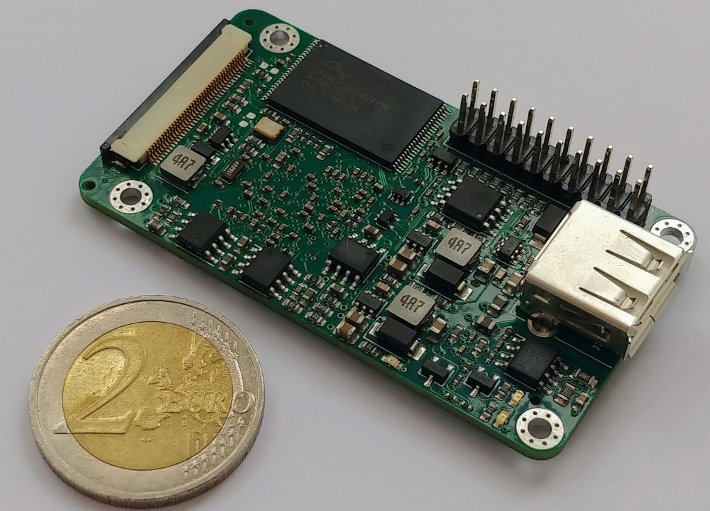
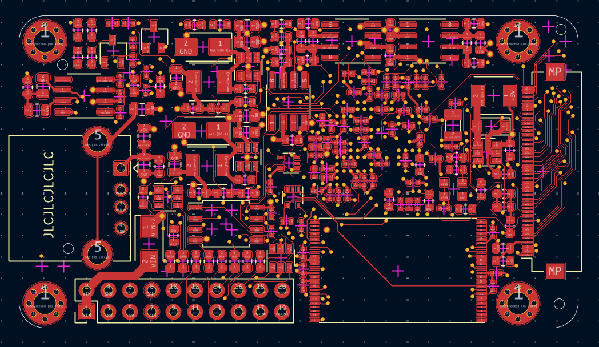
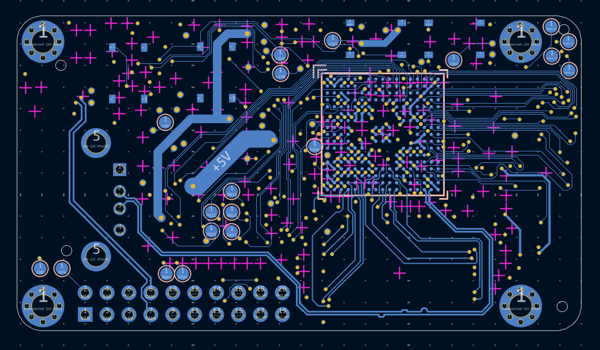
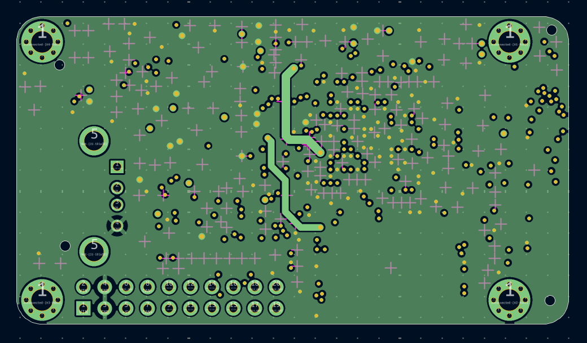
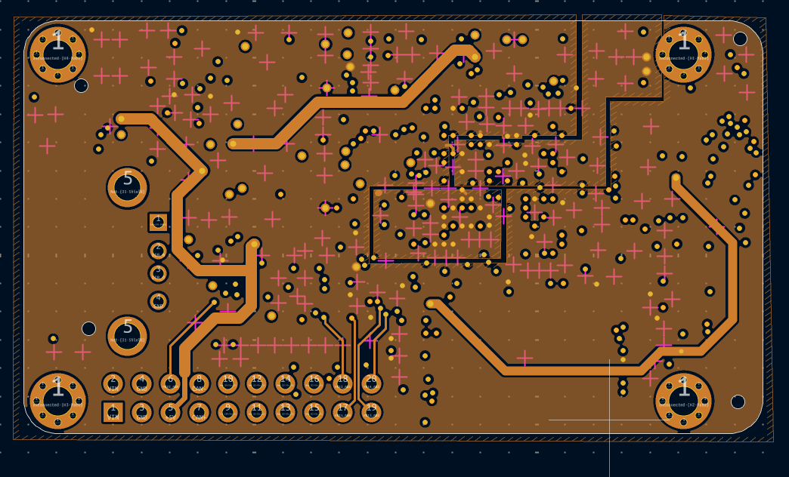

# linux-sbc-sam9x60

In 2019, when I finally decided to quit Eagle PCB and move over to KiCad, this small Linux single-board computer became my first real KiCad project.  

At the same time, it was the first time I tried JLCPCB’s PCBA service—a significant improvement in efficiency. Before that, all parts of my prototypes were fully hand-assembled by me, including all the R–C components and BGAs.  

Back then, JLC only offered top-side assembly, and the SAM9X60 CPU was not available, so I went for an unconventional placement: all parts on the top side except the CPU. This way I could hand-solder the 0.8 mm BGA at home with less risk of affecting the components on the other side.

<table>
  <tr>
    <td></td>
    <td></td>
  </tr>
  <tr>
    <td></td>
    <td></td>
  </tr>
</table>
